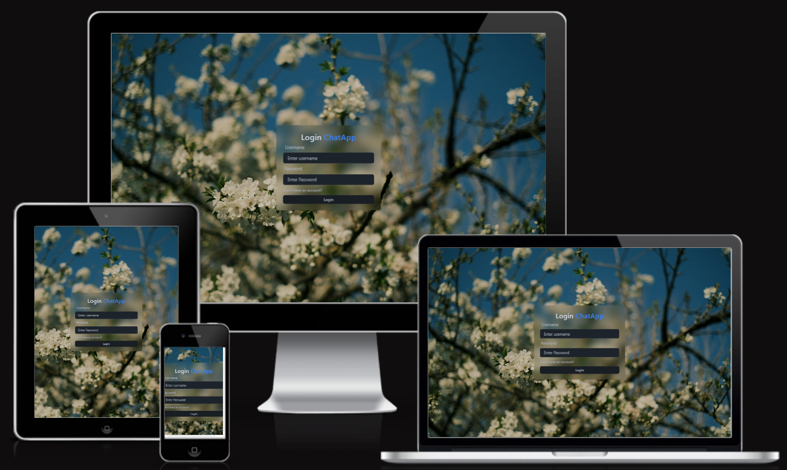

# Chat App

A real-time chat application allowing users to communicate instantly. Built using the MERN stack (MongoDB, Express, React, Node.js) and Socket.IO for real-time web socket communication.

[View Live Demo](https://real-time-chat-app-production-mdoy.onrender.com/)  
[View Repository](https://github.com/SergiyKochenko/real-time-chat-app-2)

---

## Am I Responsive?



The application is fully responsive and works seamlessly across devices, including desktops, tablets, and mobile phones.

You can test the responsiveness of the application using the [Am I Responsive?](https://ui.dev/amiresponsive) tool.

---

## Table of Contents

- [Chat App](#chat-app)
  - [Am I Responsive?](#am-i-responsive)
  - [Table of Contents](#table-of-contents)
  - [Project Goals](#project-goals)
  - [User Experience (UX)](#user-experience-ux)
    - [User Stories](#user-stories)
  - [Design](#design)
    - [Frontend Authentication Pages](#frontend-authentication-pages)
    - [Home Page UI Design](#home-page-ui-design)
    - [Wireframes](#wireframes)
    - [Color Scheme](#color-scheme)
    - [Typography](#typography)
    - [Browser Icon and App Name](#browser-icon-and-app-name)
  - [Features](#features)
    - [Existing Features](#existing-features)
    - [Future Features](#future-features)
  - [Technologies Used](#technologies-used)
    - [Frontend](#frontend)
    - [Backend](#backend)
    - [API Endpoints](#api-endpoints)
  - [Testing](#testing)
    - [Manual Testing](#manual-testing)
    - [Validator Testing](#validator-testing)
    - [Performance Testing](#performance-testing)
    - [Known Bugs](#known-bugs)
  - [Deployment](#deployment)
  - [Local Development](#local-development)
    - [Prerequisites](#prerequisites)
    - [Installation](#installation)
  - [Send Message Functionality](#send-message-functionality)
  - [Socket.IO Implementation](#socketio-implementation)
  - [API Endpoints](#api-endpoints-1)
    - [Signup Route](#signup-route)
    - [Login Route](#login-route)
    - [Logout Route](#logout-route)
    - [Message Routes](#message-routes)
      - [**GET** `/api/messages/:id`](#get-apimessagesid)
      - [**POST** `/api/messages/send/:id`](#post-apimessagessendid)
    - [User Routes](#user-routes)
      - [**GET** `/api/users/`](#get-apiusers)
  - [Testing](#testing-1)
  - [Avatar Placeholder](#avatar-placeholder)
  - [Credits](#credits)
    - [Content](#content)
    - [Media](#media)
    - [Code](#code)
    - [Acknowledgements](#acknowledgements)
  - [License](#license)

---

## Project Goals

The goal of this project is to create a real-time chat application that allows users to communicate instantly. The application is designed to provide a seamless and secure user experience with features like user authentication, profile management, and real-time messaging.

---

## User Experience (UX)

### User Stories

* As a user, I want to register an account so that I can log in and use the chat.
* As a user, I want to log in with my username and password so that I can access my chat sessions.
* As a user, I want to log out securely so that my account remains safe.
* As a user, I want to view a list of conversations in the sidebar.
* As a user, I want to select a conversation to view its messages.

---

## Design

### Frontend Authentication Pages

The application includes the following authentication pages:

1. **Login Page**  
   - A minimalistic and responsive design with a glassmorphism effect.
   - Allows users to log in using their username and password.
   - Displays real-time feedback using `react-hot-toast`.

2. **SignUp Page**  
   - A user-friendly interface for new users to register.
   - Includes fields for full name, username, password, and gender selection.
   - Displays real-time feedback using `react-hot-toast`.

3. **Logout Functionality**  
   - A logout button is available in the sidebar.
   - Displays a loading spinner during the logout process.

### Home Page UI Design

The Home Page UI has been completed with the following features:

1. **Sidebar**  
   - Includes a search input for finding conversations.
   - Displays a list of conversations with user avatars and names.
   - Provides a logout button for secure account management.

2. **Message Container**  
   - Displays the selected conversation's messages in a chat bubble format.
   - Includes a message input field with a send button for sending messages.
   - Shows a placeholder message when no chat is selected.

3. **Responsive Design**  
   - The layout is fully responsive and adapts to different screen sizes.

### Wireframes

*(Include links or images of wireframes for key pages like Login, Signup, Chat Interface, etc.)*

### Color Scheme

*(Specify the color palette used in the application.)*

### Typography

*(Specify the fonts used for headings, body text, etc.)*

### Browser Icon and App Name

- The browser icon has been updated to a custom chat icon (`chat-icon.svg`).
- The app name displayed in the browser tab is now **Go-Chat**.

---

## Features

### Existing Features

* **User Authentication:** Secure signup, login, and logout functionality using JWT and cookies.
* **Real-Time Feedback:** Integrated `react-hot-toast` for real-time notifications.
* **Sidebar Conversations:** Fetch and display a list of conversations using `zustand` for state management.
* **Profile Management:** Users can update their profile picture.
* **Responsive Design:** Fully responsive layout for all devices.

### Future Features

* Group chats.
* Online status indicators.
* Message notifications.
* Search functionality for users or messages.

---

## Technologies Used

### Frontend

* React
* Vite
* Zustand (State Management) - [Learn More](https://zustand-demo.pmnd.rs/)
* CSS (or specify framework like Tailwind CSS)
* DaisyUI (for Tailwind CSS components)
* Glassmorphism design using Tailwind CSS
* React Icons (for icons used in the UI)
* **React Hot Toast**: For real-time notifications.

### Backend

* Node.js
* Express.js
* MongoDB (Database)
* Mongoose (ODM)
* JSON Web Tokens (JWT)
* bcryptjs
* cookie-parser
* dotenv
* Cloudinary (for image uploads)

### API Endpoints

*(Add details about API endpoints as needed.)*

---

## Testing

### Manual Testing

*(Provide a table or list of manual tests performed.)*

### Validator Testing

*(Provide details about HTML, CSS, and JavaScript validation.)*

### Performance Testing

*(Include Lighthouse scores for Performance, Accessibility, Best Practices, SEO.)*

### Known Bugs

*(List any known bugs or issues.)*

---

## Deployment

The application is deployed and hosted on [Render](https://render.com). Below are the steps to deploy the application:

1. **Backend Deployment**:
   - Ensure the `backend` folder is configured with environment variables in a `.env` file.
   - Use the Render dashboard to create a new web service.
   - Connect the repository and specify the `backend` folder as the root directory.
   - Set the build command to `npm install` and the start command to `npm run server`.

2. **Frontend Deployment**:
   - Build the frontend using `npm run build` in the `frontend` folder.
   - Deploy the `frontend/dist` folder to a static hosting service like Netlify or Vercel.

3. **Environment Variables**:
   - Ensure the following environment variables are set:
     - `PORT`
     - `MONGO_DB_URI`
     - `JWT_SECRET`

4. **Socket.IO Configuration**:
   - Ensure the backend and frontend are configured to use the same Socket.IO server URL.

[View Live Demo](https://real-time-chat-app-production-mdoy.onrender.com)

---

## Local Development

### Prerequisites

* Node.js and npm (or yarn) installed.
* MongoDB instance (local or cloud-based like MongoDB Atlas).
* Cloudinary account (for image uploads).

### Installation

1. Navigate to the project directory:
    ```bash
    cd chat-app-yt
    ```

2. Initialize the project:
    ```bash
    npm init -y
    ```

3. Backend Setup:
    ```bash
    cd backend
    npm install express dotenv cookie-parser bcryptjs mongoose socket.io jsonwebtoken
    npm install nodemon --save-dev
    ```

4. Generate a JWT secret:
    ```bash
    openssl rand -base64 32
    ```
    Copy the generated secret and add it to your `.env` file:
    ```
    JWT_SECRET=<your_generated_secret>
    ```

5. Database Setup:
    - Use MongoDB Atlas or a local MongoDB instance.
    - Add the connection string to your `.env` file:
      ```
      MONGO_DB_URI=<your_mongodb_connection_string>
      ```

6. Start the backend server:
    ```bash
    npm run server
    ```

7. Frontend Setup:
    ```bash
    cd ../frontend
    npm install
    npm install socket.io-client
    ```

---

## Send Message Functionality

This application enables users to send text messages to each other in real-time. The message sending process involves both frontend and backend components working together seamlessly.

**Frontend Implementation:** 

-   The `MessageInput.jsx` component provides an input field and a send button.
-   The `useSendMessages.js` hook is responsible for sending the message to the backend API.
-   Upon successfully sending the message, the new message is added to the local state using Zustand.

**Backend Implementation:** 

-   The `sendMessage` function in `message.controller.js` handles the message creation and storage in MongoDB.
-   Socket.IO is used to emit the new message to the recipient in real-time.

## Socket.IO Implementation

Socket.IO is used to provide real-time communication features in this application. It enables instant message delivery and online status updates.

**Backend Setup:** 

-   The Socket.IO server is initialized in `socket/socket.js`.
-   It listens for new connections and manages user online status.
-   When a new message is sent, the server emits the message to the intended recipient.

**Frontend Setup:** 

-   The `SocketContext.jsx` provides the Socket.IO client instance to the entire application.
-   It connects to the Socket.IO server upon authentication.
-   The `useListenMessages.js` hook listens for incoming messages and updates the local state using Zustand.

---

## API Endpoints

### Signup Route

**POST** `/api/auth/signup`  
**Description:** Registers a new user.  

**Request Body:**
```json
{
    "fullName": "John Doe",
    "username": "johndoe",
    "password": "password123",
    "confirmPassword": "password123",
    "gender": "male"
}
```

**Response:**
```json
{
    "_id": "user_id",
    "fullName": "John Doe",
    "username": "johndoe",
    "profilePic": "https://avatar.iran.liara.run/public/boy?username=johndoe"
}
```

---

### Login Route

**POST** `/api/auth/login`  
**Description:** Logs in an existing user.  

**Request Body:**
```json
{
    "username": "johndoe",
    "password": "password123"
}
```

**Response:**
```json
{
    "_id": "user_id",
    "fullName": "John Doe",
    "username": "johndoe",
    "profilePic": "https://avatar.iran.liara.run/public/boy?username=johndoe"
}
```

---

### Logout Route

**POST** `/api/auth/logout`  
**Description:** Logs out the current user by clearing the JWT cookie.  

**Response:**
```json
{
    "message": "Logged out successfully"
}
```

---

### Message Routes

#### **GET** `/api/messages/:id`
**Description:** Fetch all messages in a conversation between the logged-in user and the user specified by `id`.

**Headers:**
- `Authorization`: Bearer `<JWT Token>`

**Response:**
- **200 OK**: Returns an array of messages.
- **401 Unauthorized**: If the user is not authenticated.
- **500 Internal Server Error**: If an error occurs on the server.

**Example Response:**
```json
[
    {
        "_id": "message_id",
        "senderId": "sender_user_id",
        "receiverId": "receiver_user_id",
        "message": "Hello!",
        "createdAt": "2023-10-01T12:00:00.000Z",
        "updatedAt": "2023-10-01T12:00:00.000Z"
    }
]
```

---

#### **POST** `/api/messages/send/:id`
**Description:** Send a message to the user specified by `id`.

**Headers:**
- `Authorization`: Bearer `<JWT Token>`

**Request Body:**
```json
{
    "message": "Hello, how are you?"
}
```

**Response:**
- **201 Created**: Returns the created message.
- **401 Unauthorized**: If the user is not authenticated.
- **500 Internal Server Error**: If an error occurs on the server.

**Example Response:**
```json
{
    "_id": "message_id",
    "senderId": "sender_user_id",
    "receiverId": "receiver_user_id",
    "message": "Hello, how are you?",
    "createdAt": "2023-10-01T12:00:00.000Z",
    "updatedAt": "2023-10-01T12:00:00.000Z"
}
```

---

### User Routes

#### **GET** `/api/users/`
**Description:** Fetches a list of users excluding the logged-in user for the sidebar.

**Headers:**
- `Authorization`: Bearer `<JWT Token>`

**Response:**
- **200 OK**: Returns an array of user objects excluding the logged-in user.
- **401 Unauthorized**: If the user is not authenticated.
- **500 Internal Server Error**: If an error occurs on the server.

**Example Response:**
```json
[
    {
        "_id": "user_id_1",
        "fullName": "Jane Doe",
        "username": "janedoe",
        "profilePic": "https://avatar.iran.liara.run/public/girl?username=janedoe"
    },
    {
        "_id": "user_id_2",
        "fullName": "John Smith",
        "username": "johnsmith",
        "profilePic": "https://avatar.iran.liara.run/public/boy?username=johnsmith"
    }
]
```

---

## Testing

All routes (Signup, Login, Logout) were tested using [Postman](https://www.postman.com/). Below are the steps to test:

1. Open Postman and create a new request.
2. Set the request type to `POST`.
3. Enter the appropriate route URL (e.g., `http://localhost:5000/api/auth/signup`).
4. Add the required request body in JSON format.
5. Send the request and verify the response.

---

## Avatar Placeholder

The application uses the following service for generating profile pictures:  
[https://avatar-placeholder.iran.liara.run/](https://avatar-placeholder.iran.liara.run/)

- Male Avatar: `https://avatar.iran.liara.run/public/boy?username=<username>`
- Female Avatar: `https://avatar.iran.liara.run/public/girl?username=<username>`

---

## Credits

### Content

* [React Hot Toast Documentation](https://react-hot-toast.com/)
* [Zustand Documentation](https://zustand-demo.pmnd.rs/)

### Media

*(Acknowledge sources for images, icons, etc.)*

### Code

*(Acknowledge any significant code snippets or libraries used.)*

### Acknowledgements

* Thanks to the creators of React, Tailwind CSS, DaisyUI, and Zustand for their amazing tools.

---

## License

*(Specify the license for your project, e.g., MIT License.)*
