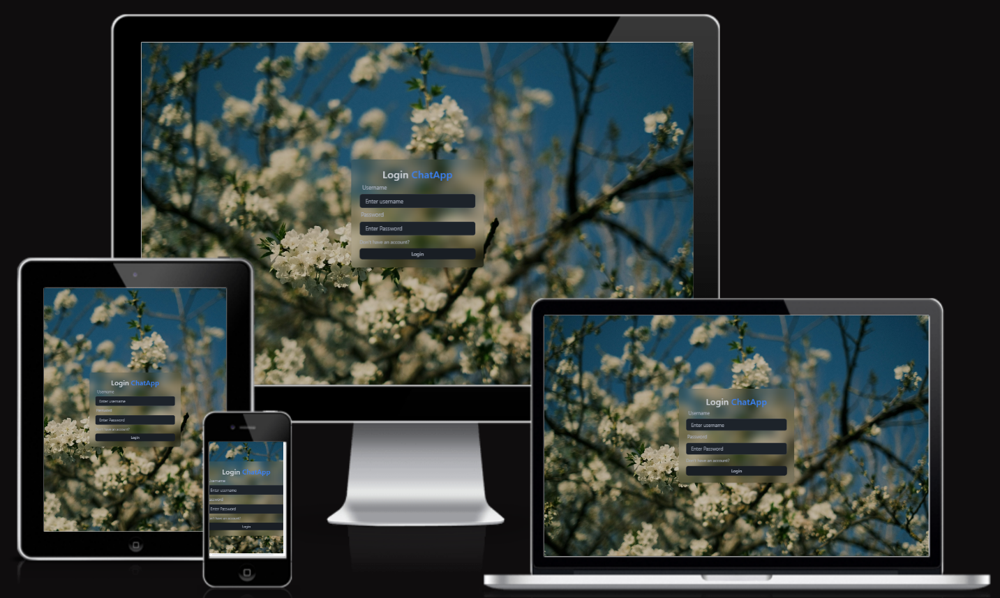
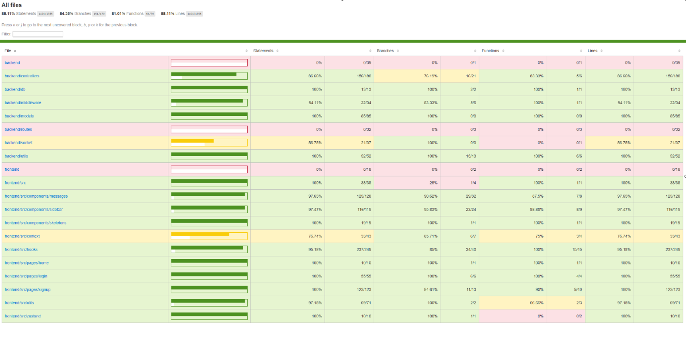

# Real-Time Chat App

A real-time chat application allowing users to communicate instantly. Built using the MERN stack (MongoDB, Express, React, Node.js) and Socket.IO for real-time web socket communication.

[View Live Demo](https://real-time-chat-app-production-mdoy.onrender.com/)  
[View Repository](https://github.com/SergiyKochenko/real-time-chat-app-2)

---

## Am I Responsive?



The application is fully responsive and works seamlessly across devices, including desktops, tablets, and mobile phones.

You can test the responsiveness of the application using the [Am I Responsive?](https://ui.dev/amiresponsive) tool.

---

## Table of Contents

- [Real-Time Chat App](#real-time-chat-app)
  - [Am I Responsive?](#am-i-responsive)
  - [Table of Contents](#table-of-contents)
  - [Project Goals](#project-goals)
  - [User Experience (UX)](#user-experience-ux)
    - [User Stories](#user-stories)
  - [Design](#design)
    - [Frontend Authentication Pages](#frontend-authentication-pages)
    - [Home Page UI Design](#home-page-ui-design)
    - [Wireframes](#wireframes)
    - [Color Scheme](#color-scheme)
    - [Typography](#typography)
    - [Browser Icon and App Name](#browser-icon-and-app-name)
  - [Features](#features)
    - [Existing Features](#existing-features)
    - [Future Features](#future-features)
  - [Technologies Used](#technologies-used)
    - [Frontend](#frontend)
    - [Backend](#backend)
    - [API Endpoints](#api-endpoints)
  - [Testing](#testing)
    - [Manual Testing](#manual-testing)
    - [Validator Testing](#validator-testing)
    - [Performance Testing](#performance-testing)
    - [Known Bugs](#known-bugs)
  - [DevOps Implementation Strategy](#devops-implementation-strategy)
    - [Introduction](#introduction)
    - [Overall Strategy](#overall-strategy)
    - [Branching Strategy and Integration Controls](#branching-strategy-and-integration-controls)
    - [Continuous Integration and Deployment Pipeline](#continuous-integration-and-deployment-pipeline)
    - [Software Release Strategy](#software-release-strategy)
    - [Pipeline Technology and Tool Selection](#pipeline-technology-and-tool-selection)
  - [Deployment](#deployment)
  - [Local Development](#local-development)
    - [Prerequisites](#prerequisites)
    - [Installation](#installation)
    - [Automated Testing \& Quality Checks](#automated-testing--quality-checks)
    - [Test \& Coverage Snapshot (13 Mar 2026)](#test--coverage-snapshot-13-mar-2026)
  - [Send Message Functionality](#send-message-functionality)
  - [Socket.IO Implementation](#socketio-implementation)
  - [API Endpoints](#api-endpoints-1)
    - [Signup Route](#signup-route)
    - [Login Route](#login-route)
    - [Logout Route](#logout-route)
    - [Message Routes](#message-routes)
      - [**GET** `/api/messages/:id`](#get-apimessagesid)
      - [**POST** `/api/messages/send/:id`](#post-apimessagessendid)
    - [User Routes](#user-routes)
      - [**GET** `/api/users/`](#get-apiusers)
  - [Testing](#testing-1)
  - [Avatar Placeholder](#avatar-placeholder)
  - [Credits](#credits)
    - [Content](#content)
    - [Media](#media)
    - [Code](#code)
    - [Acknowledgements](#acknowledgements)
  - [References](#references)
    - [DevOps Strategy \& Principles](#devops-strategy--principles)
    - [Platform \& Tool Documentation](#platform--tool-documentation)
    - [Security \& Scanning Tools](#security--scanning-tools)
    - [Infrastructure \& Configuration](#infrastructure--configuration)

---

## Project Goals

The goal of this project is to create a real-time chat application that allows users to communicate instantly. The application is designed to provide a seamless and secure user experience with features like user authentication, profile management, and real-time messaging.

---

## User Experience (UX)

### User Stories

- As a user, I want to register an account so that I can log in and use the chat.
- As a user, I want to log in with my username and password so that I can access my chat sessions.
- As a user, I want to log out securely so that my account remains safe.
- As a user, I want to view a list of conversations in the sidebar.
- As a user, I want to select a conversation to view its messages.

---

## Design

### Frontend Authentication Pages

The application includes the following authentication pages:

1. **Login Page**
   - A minimalistic and responsive design with a glassmorphism effect.
   - Allows users to log in using their username and password.
   - Displays real-time feedback using `react-hot-toast`.

2. **SignUp Page**
   - A user-friendly interface for new users to register.
   - Includes fields for full name, username, password, and gender selection.
   - Displays real-time feedback using `react-hot-toast`.

3. **Logout Functionality**
   - A logout button is available in the sidebar.
   - Displays a loading spinner during the logout process.

### Home Page UI Design

The Home Page UI has been completed with the following features:

1. **Sidebar**
   - Includes a search input for finding conversations.
   - Displays a list of conversations with user avatars and names.
   - Provides a logout button for secure account management.

2. **Message Container**
   - Displays the selected conversation's messages in a chat bubble format.
   - Includes a message input field with a send button for sending messages.
   - Shows a placeholder message when no chat is selected.

3. **Responsive Design**
   - The layout is fully responsive and adapts to different screen sizes.

### Wireframes

_(Include links or images of wireframes for key pages like Login, Signup, Chat Interface, etc.)_

### Color Scheme

_(Specify the color palette used in the application.)_

### Typography

_(Specify the fonts used for headings, body text, etc.)_

### Browser Icon and App Name

- The browser icon has been updated to a custom chat icon (`chat-icon.svg`).
- The app name displayed in the browser tab is now **Go-Chat**.

---

## Features

### Existing Features

- **User Authentication:** Secure signup, login, and logout functionality using JWT and cookies.
- **Real-Time Feedback:** Integrated `react-hot-toast` for real-time notifications.
- **Sidebar Conversations:** Fetch and display a list of conversations using `zustand` for state management.
- **Profile Management:** Users can update their profile picture.
- **Responsive Design:** Fully responsive layout for all devices.

### Future Features

- Group chats.
- Online status indicators.
- Message notifications.
- Search functionality for users or messages.

---

## Technologies Used

### Frontend

- React
- Vite
- Zustand (State Management) - [Learn More](https://zustand-demo.pmnd.rs/)
- CSS (or specify framework like Tailwind CSS)
- DaisyUI (for Tailwind CSS components)
- Glassmorphism design using Tailwind CSS
- React Icons (for icons used in the UI)
- **React Hot Toast**: For real-time notifications.

### Backend

- Node.js
- Express.js
- MongoDB (Database)
- Mongoose (ODM)
- JSON Web Tokens (JWT)
- bcryptjs
- cookie-parser
- dotenv
- Cloudinary (for image uploads)

### API Endpoints

_(Add details about API endpoints as needed.)_

---

## Testing

### Manual Testing

The application was thoroughly tested during development and after deployment to ensure all features work as expected. The table below summarizes the manual testing results:

| Goals/Actions                           | As a Guest | As a Logged User | Result | Comment                                                               |
| --------------------------------------- | :--------: | :--------------: | :----: | --------------------------------------------------------------------- |
| User can access the home page           |     ✓      |        ✓         |  Pass  | The home page loads successfully for both guests and logged-in users. |
| User can register an account            |     ✓      |        ✓         |  Pass  | The registration form works correctly and creates a new user account. |
| User can log in                         |     ✓      |        ✓         |  Pass  | Users can log in with valid credentials.                              |
| User can log out                        |     ✗      |        ✓         |  Pass  | The logout button clears the session and redirects to the login page. |
| User can view the chat interface        |     ✗      |        ✓         |  Pass  | The chat interface is accessible only to logged-in users.             |
| User can send messages                  |     ✗      |        ✓         |  Pass  | Messages are sent and displayed in real-time using Socket.IO.         |
| User can receive messages               |     ✗      |        ✓         |  Pass  | Incoming messages are displayed instantly in the chat interface.      |
| User can view online users              |     ✗      |        ✓         |  Pass  | The sidebar displays a list of online users.                          |
| User can update their profile picture   |     ✗      |        ✓         |  Pass  | Users images upload and update their profile automaticaly.            |
| User can view conversations in sidebar  |     ✗      |        ✓         |  Pass  | The sidebar displays a list of conversations for logged-in users.     |
| User can search for conversations       |     ✗      |        ✓         |  Pass  | The search input filters conversations in real-time.                  |
| User can view a conversation's messages |     ✗      |        ✓         |  Pass  | Clicking a conversation displays its messages in the chat interface.  |
| User can view responsive design         |     ✓      |        ✓         |  Pass  | The application is fully responsive across devices.                   |

### Validator Testing

_(Provide details about HTML, CSS, and JavaScript validation.)_

### Performance Testing

_(Include Lighthouse scores for Performance, Accessibility, Best Practices, SEO.)_

### Known Bugs

_(List any known bugs or issues.)_

---

## DevOps Implementation Strategy

### Introduction

**Project Overview:**

The Real-Time Chat App is a full-stack web application that supports real-time one-to-one and group communication. The technology stack includes:
- **Frontend:** React (Vite)
- **Backend:** Node.js/Express with Socket.IO
- **Database:** MongoDB
- **Deployment Target:** Container-based hosting on Azure Web App for Containers
- **Source Control:** GitHub with GitHub Actions for CI/CD orchestration

**Team Structure:**

The project is delivered by a multi-disciplinary team of eight professionals:
- 2 Backend Engineers
- 2 Frontend Engineers
- 1 DevOps/Platform Engineer
- 1 QA Automation Engineer
- 1 Product Owner/Scrum Facilitator
- 1 Security Champion (shared responsibility across senior developers)

This team structure supports contemporary DevOps practices with shared ownership of quality, secure-by-default engineering, rapid feedback loops, and collaborative operations.

---

### Overall Strategy

**Vision (12-24 months):**

DevOps success means the team can deliver small, low-risk changes to production multiple times per day with high reliability, low recovery time, and complete deployment traceability. Success is evidenced by sustained DORA improvements, stable SLOs, and predictable release flow.

**Core Values & Principles:**

- **Automation-first engineering:** Pipeline-as-code, IaC, automated tests and security scanning
- **Quality-as-code:** Tests and linting integrated into every commit
- **Security-by-default:** Dependency scanning, SAST, vulnerability policies enforced before merge
- **Transparency and shared responsibility:** Blameless postmortems, shared incident ownership, cross-functional reviews
- **Small, reversible changes:** Short-lived branches, atomic commits, easy rollbacks
- **Continuous learning:** Evidence-driven decisions via DORA metrics, SRE SLO tracking, and retrospectives

**CAMS Framework Application:**

- **Culture:** Blameless postmortems, shared incident ownership, cross-functional code reviews
- **Automation:** Pipeline-as-code, IaC, automated tests and security scanning
- **Measurement:** DORA metrics, SRE SLO/error-budget tracking, CI performance indicators
- **Sharing:** ADRs, runbooks, review checklists, release notes and incident write-ups

**DORA Metrics Goals:**

| Metric | Baseline | 8 Weeks | 6 Months |
|--------|----------|---------|----------|
| **Deployment Frequency** | 1 per week | ≥1 per day | ≥3 per day |
| **Lead Time for Changes** | ~1 day | <2 hours | <1 hour |
| **Change Failure Rate** | Untracked | ≤10% | ≤7% |
| **Mean Time to Recovery (Sev1)** | ~2 hours | <30 minutes | <20 minutes |

---

### Branching Strategy and Integration Controls

**Branching Model:**

The recommended strategy is **Trunk-Based Development** with short-lived branches, selected for its alignment with frequent integration and rapid deployment while minimizing merge debt and long-lived branch risk.

**Branch Policy:**
- **main:** Protected, always releasable, deployment-ready
- **feature branches:** `feat/*`, `fix/*`, `chore/*`, `docs/*` — target lifetime ≤48 hours
- **hotfix branches:** `hotfix/*` — urgent production fixes, merged back to main immediately
- **Release management:** Semantic versioning tags (`vX.Y.Z`, `vX.Y.Z-rc.N`)

**Protection Rules & Code Review Policy:**

- **Pull Request Required:** All changes to main must go through code review
- **Approval Requirements:**
  - Normal changes: ≥1 approval
  - High-risk areas (auth, security, database schema, deployment workflows): ≥2 approvals
- **CODEOWNERS Enforcement:** Enforced for backend controllers, auth middleware, workflows, and infrastructure files
- **Stale Approvals:** Dismissed after new commits
- **Conversation Resolution:** Required before merge
- **Protected Actions:** Force push and direct push to main are disabled
- **Merge Strategy:** Squash merge with Conventional Commits for traceable changelog and semantic versioning

**Required CI Gate Checks:**

Before code can merge into main, the following checks must pass:
- ✅ Build pass (frontend and backend)
- ✅ Unit and integration tests (≥80% coverage threshold)
- ✅ Linting and code formatting
- ✅ Static analysis / SAST
- ✅ Dependency and container vulnerability scans
- ✅ SBOM generation and policy validation

**Code Review as Knowledge Sharing:**

Code review is used as a quality and learning mechanism, not only a merge gate. The team employs:
- Rotating reviewers to spread system knowledge
- Checklist-based reviews focusing on architecture, security, and maintainability
- Cross-component review participation from multiple specialists
- Required rationale comments and linked evidence (tests, metrics impact, rollback plan) for non-trivial changes

---

### Continuous Integration and Deployment Pipeline

**Workflow Architecture & Design Principles:**

- **Philosophy:** Reusable workflows/composite actions, fail-fast gates, immutable artifact promotion
- **Runner Strategy:** GitHub-hosted `ubuntu-latest` by default; self-hosted runners reserved for specific workloads or network constraints
- **Concurrency Model:** Cancel in-progress runs for PR branches; protect production deployment jobs from cancellation once started
- **Secrets & Environment Strategy:** GitHub Environments (dev/staging/production) with environment-scoped secrets, OIDC federation to Azure, no long-lived cloud credentials

**Continuous Integration Pipeline:**

**CI Triggers:**
- Pull requests to main
- Pushes to main
- Manual dispatch (workflow_dispatch)

**CI Job Design & Execution:**

| Job | Stage | Purpose | Dependencies |
|-----|-------|---------|--------------|
| **Static Checks** | Parallel | Lint, format validation | None |
| **Backend Tests** | Parallel | Unit + integration tests | None |
| **Frontend Tests** | Parallel | Unit/component tests | None |
| **Security Scan** | Parallel | Dependency audit + SAST | None |
| **Build/Package** | Sequential | Compile artifacts | All parallel jobs |
| **Container Build** | Sequential | Docker image creation & scan | Build pass |

**Caching & Artifacts:**

- Node.js dependency caching via `actions/setup-node` (root + frontend lockfiles)
- Build artifacts uploaded for traceability (frontend dist, test reports, coverage summaries)
- Container image tags:
  - Commit SHA (for traceability)
  - Semantic version tags on releases
  - `latest-main` for non-production deployments

**Software Bill of Materials (SBOM):**

- SBOM generated with Syft for each release artifact
- Trivy-based vulnerability scanning fails pipeline on high/critical vulnerabilities
- Vulnerability policy enforced before build completion

**Continuous Delivery / Deployment Pipeline:**

**CD Architecture:**

- **dev environment:** Auto-triggered after successful main pipeline
- **staging environment:** Promoted only after dev smoke checks pass
- **production environment:** Requires manual environment approvals and signed/release tag restrictions

**GitHub Environments Configuration:**

| Environment | Required Reviewers | Wait Timer | Branch/Tag Restrictions | Sealed Secrets |
|-------------|-------------------|------------|------------------------|----------------|
| **dev** | None (auto) | None | main only | Dev-scoped |
| **staging** | 1 reviewer | 1 hour | Release tags only | Staging-scoped |
| **production** | 2 reviewers | 4 hours | Signed release tags | Production-scoped |

**Post-Deploy Verification & Rollback:**

- **Automated smoke checks:** Health endpoint, auth flow, WebSocket connect/send/receive
- **Canary observation window:** Error-rate and latency threshold checks (5-minute window)
- **Automatic rollback:** Triggered on sustained threshold breach (e.g., error rate >5%, p99 latency >2s)
- **Rollback mechanism:** Revert to previous immutable image digest; alert on-call team

**DORA Metric Capture:**

- **Deployment Frequency:** Count successful production deployments from workflow events
- **Lead Time for Changes:** Measure commit timestamp → production deploy timestamp
- **Change Failure Rate & MTTR:** Correlate failed deployments/incidents with resolution timestamps via GitHub Deployments API

---

### Software Release Strategy

**Deployment Pipeline Stages & Gates:**

| Stage | Trigger | Automated Gates | Manual Gates | Promotion Criteria |
|-------|---------|-----------------|--------------|-------------------|
| **dev** | Main push | CI + smoke tests | None | CI green |
| **staging** | Dev success | Integration/regression tests | 1 reviewer | Tests green + approval |
| **production** | Staging release tag | Smoke + canary | 2 reviewers + deployment policy | All gates green |

**Deployment Strategy:**

- **Primary:** Canary rollout for backend/API changes (limit blast radius)
- **Secondary:** Blue/green for major infra/runtime transitions
- **Feature flags:** Decouple release from feature exposure for high-risk features
- **Progressive delivery:** Gradual traffic shift with observability-driven go/no-go decisions

**Rollback & Risk Control:**

- **Rollback mechanism:** Revert to previous known-good immutable image digest
- **Automated rollback triggers:** Sustained threshold breach (error rate, latency, smoke failure)
- **Operational resilience:** Standardized incident runbooks and recovery drills to maintain MTTR target
- **Change management:** Deployment blackout windows, on-call readiness, staged rollbacks for large audiences

**Increasing Release Frequency Safely:**

- Smaller PRs and short-lived branches (≤48 hour target)
- Higher automation coverage in tests/security gates
- Progressive delivery with observability-driven go/no-go decisions
- Blameless postmortems and DORA-driven feedback loops

**Environment Parity & Configuration Management:**

- **Containerization:** Dockerized workloads across dev/staging/production
- **Infrastructure as Code:** IaC-managed environment resources and configuration (Bicep/Terraform)
- **Secrets & Configuration:** Scoped per environment using GitHub Environments and Azure Key Vault
- **Version Control:** Semantic Versioning for deterministic promotion and complete traceability

---

### Pipeline Technology and Tool Selection

**DevOps Toolchain Overview:**

| Category | Selected Tool | Justification |
|----------|---------------|---------------|
| **Source Code Management** | GitHub | Native integration with Actions, strong enterprise features, branch protection policies, CODEOWNERS |
| **CI/CD Orchestration** | GitHub Actions | Workflow-as-code, reusable workflows, native to source repo, no external pricing model |
| **Artifact Registry** | GitHub Container Registry (ghcr.io) | Integrated with GitHub, OIDC-based auth, cost-effective for private images |
| **Container Platform** | Docker | Industry standard, multi-platform support, efficient layer caching |
| **Infrastructure as Code** | Azure Bicep | Azure-native, readable syntax, full resource type support, integrated validation |
| **Secrets Management** | Azure Key Vault + OIDC | Zero long-lived credentials, GitHub OIDC federation, audit trail |
| **Observability - Logs** | Azure Application Insights | Integrated with app runtime, structured logging, dependency tracking |
| **Observability - Metrics** | Azure Monitor | DORA metric collection, custom dashboards, alert rules |
| **Observability - Tracing** | OpenTelemetry (future) | Vendor-agnostic, distributed tracing, W3C Trace Context standard |
| **Container Scanning** | Trivy + Syft | Fast vuln scanning, SBOM generation, policy integration |
| **SAST** | GitHub CodeQL | Free for public repos, integrated into Actions, comprehensive Java/JS/TS support |
| **Dependency Scanning** | Dependabot + npm audit | Native GitHub integration, automated PRs, policy enforcement |

**Toolchain Architecture:**

```
┌─────────────────────────────────────────────────────────────┐
│                       GitHub Repository                      │
│  (Source Code + Workflows + CODEOWNERS + Branch Protection)  │
└─────────────────────┬───────────────────────────────────────┘
                      │
                      ▼
┌─────────────────────────────────────────────────────────────┐
│              GitHub Actions CI/CD Pipelines                   │
│  ┌──────────────────────────────────────────────────────┐    │
│  │  Pull Request Workflow                                │    │
│  │  - Static checks (lint, format)                       │    │
│  │  - Backend/Frontend tests                             │    │
│  │  - Security scan (CodeQL, Dependabot)                 │    │
│  └──────────────────────────────────────────────────────┘    │
│  ┌──────────────────────────────────────────────────────┐    │
│  │  Main Push Workflow (CI/CD)                           │    │
│  │  - All PR checks                                      │    │
│  │  - Build & publish container to ghcr.io              │    │
│  │  - SBOM generation (Syft)                             │    │
│  │  - Trivy scan + policy gate                           │    │
│  │  - Dev environment deploy                             │    │
│  └──────────────────────────────────────────────────────┘    │
│  ┌──────────────────────────────────────────────────────┐    │
│  │  Release Workflow (CD)                                │    │
│  │  - Manual promotion to staging/production             │    │
│  │  - Environment approvals (2-reviewer production)      │    │
│  │  - Canary deploy with smoke checks                    │    │
│  │  - Metric capture & rollback automation               │    │
│  └──────────────────────────────────────────────────────┘    │
└──────────┬──────────────┬────────────────┬──────────────────┘
           │              │                │
           ▼              ▼                ▼
┌────────────────┐ ┌──────────────┐ ┌─────────────────────┐
│ ghcr.io        │ │ Azure Key    │ │ Azure Monitoring    │
│ (Container     │ │ Vault        │ │ - Logs              │
│  Registry)     │ │ (Secrets)    │ │ - Metrics           │
└────────────────┘ └──────────────┘ │ - Alerts            │
           │                         └─────────────────────┘
           │                                  │
           ▼                                  ▼
┌──────────────────────────────────────────────────────┐
│        Azure Web App for Containers                   │
│  ┌──────────────────────────────────────────────┐   │
│  │ Development  │ Staging  │ Production         │   │
│  └──────────────────────────────────────────────┘   │
└──────────────────────────────────────────────────────┘
```

**Continuous Improvement & Metrics:**

The DevOps strategy evolves from a simple CI-first mindset to a measurable, policy-driven delivery model. Key improvements include:

- **Explicit DORA correlation:** Design choices directly linked to Deployment Frequency, Lead Time, Change Failure Rate, and MTTR outcomes
- **Immutable artifact promotion:** Ensures safer rollbacks and faster MTTR
- **Environment approvals & policy gates:** Reduces production incidents through controlled promotion
- **Observability integration:** Automated metric capture from GitHub Actions for data-driven improvements

**Future Roadmap:**

- Enhanced synthetic monitoring and end-to-end test coverage
- Distributed tracing with OpenTelemetry
- Improved canary automation with traffic shifting
- Broader performance profiling and cost optimization
- Ongoing calibration of targets using real pipeline telemetry

---

## Deployment

The application is deployed and hosted on [Render](https://render.com). Below are the steps to deploy the application:

1. **Backend Deployment**:
   - Ensure the `backend` folder is configured with environment variables in a `.env` file.
   - Use the Render dashboard to create a new web service.
   - Connect the repository and specify the `backend` folder as the root directory.
   - Set the build command to `npm install` and the start command to `npm run server`.

2. **Frontend Deployment**:
   - Build the frontend using `npm run build` in the `frontend` folder.
   - Deploy the `frontend/dist` folder to a static hosting service like Netlify or Vercel.

3. **Environment Variables**:
   - Ensure the following environment variables are set:
     - `PORT`
     - `MONGO_DB_URI`
     - `JWT_SECRET`
     - `AVATAR_TEMPLATE_URL` (optional) — points to the remote provider that generates profile images.

4. **Socket.IO Configuration**:
   - Ensure the backend and frontend are configured to use the same Socket.IO server URL.

[View Live Demo](https://real-time-chat-app-production-mdoy.onrender.com)

---

## Local Development

### Prerequisites

- Node.js and npm (or yarn) installed.
- MongoDB instance (local or cloud-based like MongoDB Atlas).
- Cloudinary account (for image uploads).

### Installation

1. Navigate to the project directory:

   ```bash
   cd chat-app-yt
   ```

2. Initialize the project:

   ```bash
   npm init -y
   ```

3. Backend Setup:

   ```bash
   cd backend
   npm install express dotenv cookie-parser bcryptjs mongoose socket.io jsonwebtoken
   npm install nodemon --save-dev
   ```

4. Generate a JWT secret:

   ```bash
   openssl rand -base64 32
   ```

   Copy the generated secret and add it to your `.env` file:

   ```
   JWT_SECRET=<your_generated_secret>
   ```

5. Database Setup:
   - Use MongoDB Atlas or a local MongoDB instance.
   - Add the connection string to your `.env` file:
     ```
     MONGO_DB_URI=<your_mongodb_connection_string>
     ```

6. Avatar Provider (optional but recommended):
   - Configure a remote avatar generator by adding the template URL to `.env`:
     ```
     AVATAR_TEMPLATE_URL=https://avatar.iran.liara.run/public/{{genderPath}}?username={{username}}
     ```
   - Replace the URL with any service that accepts `{{username}}` and `{{genderPath}}` (values `boy`/`girl`) placeholders.

7. Start the backend server:

   ```bash
   npm run server
   ```

8. Frontend Setup:
   ```bash
   cd ../frontend
   npm install
   npm install socket.io-client
   ```

### Automated Testing & Quality Checks

The repository is configured as an npm workspace so the frontend reuses the root React installation. Run all validation commands from the project root unless stated otherwise:

1. **Unit & integration tests** (backend + frontend):

```bash
npm run test
```

Use `npm run test:watch` while iterating locally.

2. **Frontend linting** (Vitest globals + hooks overrides already configured):

```bash
npm --workspace frontend run lint
```

3. **Coverage gate (≥80% lines/funcs/branches/statements):**

```bash
npm run test -- --coverage
```

This uses `@vitest/coverage-v8` and fails the pipeline if the global thresholds drop below 80%. The latest run produced ~88% line coverage, ~84% branch coverage, and ~81% function coverage across the combined backend/frontend surface area (see `coverage/` artifacts for detailed HTML reports).

All three commands are exercised inside the CI workflow to keep CA1 deliverables green.

### Test & Coverage Snapshot (13 Mar 2026)

- **Vitest run:** `npm run test -- --coverage`
- **Result:** 35 files / 72 tests passing (no skips) in ≈15.7s wall time
- **Environment breakdown:** transform 1.84s · setup 9.24s · collect 13.65s · tests 3.95s · env 38.96s · prepare 9.65s


| File / Area                      | % Stmts | % Branch | % Funcs | % Lines | Notes                                                  |
| -------------------------------- | ------- | -------- | ------- | ------- | ------------------------------------------------------ |
| **All files**                    | 88.11   | 84.35    | 81.01   | 88.11   | Global thresholds (≥80%) satisfied                     |
| backend/controllers              | 86.66   | 76.19    | 83.33   | 86.66   | Auth/message suites dominate branch deltas             |
| backend/middleware               | 94.11   | 83.33    | 100     | 94.11   | `protectRoute` defensive branches only misses          |
| backend/routes                   | 0       | 0        | 0       | 0       | Route wiring intentionally excluded from current suite |
| backend/socket                   | 56.75   | 100      | 0       | 56.75   | Remaining TODO: add socket handshake emitter specs     |
| frontend/src/components/messages | 97.65   | 90.62    | 87.5    | 97.65   | Message UI covered by RTL suites                       |
| frontend/src/components/sidebar  | 97.47   | 95.83    | 88.88   | 97.47   | Search + logout interactions validated                 |
| frontend/src/context             | 76.74   | 85.71    | 75      | 76.74   | Next target: extra AuthContext edge cases              |
| frontend/src/hooks               | 95.18   | 85       | 100     | 95.18   | All network hooks mocked + asserted                    |
| frontend/src/pages/signup        | 100     | 84.61    | 90      | 100     | Gender checkbox still has two untested branches        |

> Full HTML/LCOV artifacts live under `coverage/`; regenerate with `npm run test -- --coverage` after any changes.

**Coverage Visualization:**



---

## Send Message Functionality

This application enables users to send text messages to each other in real-time. The message sending process involves both frontend and backend components working together seamlessly.

**Frontend Implementation:**

- The `MessageInput.jsx` component provides an input field and a send button.
- The `useSendMessages.js` hook is responsible for sending the message to the backend API.
- Upon successfully sending the message, the new message is added to the local state using Zustand.

**Backend Implementation:**

- The `sendMessage` function in `message.controller.js` handles the message creation and storage in MongoDB.
- Socket.IO is used to emit the new message to the recipient in real-time.

## Socket.IO Implementation

Socket.IO is used to provide real-time communication features in this application. It enables instant message delivery and online status updates.

**Backend Setup:**

- The Socket.IO server is initialized in `socket/socket.js`.
- It listens for new connections and manages user online status.
- When a new message is sent, the server emits the message to the intended recipient.

**Frontend Setup:**

- The `SocketContext.jsx` provides the Socket.IO client instance to the entire application.
- It connects to the Socket.IO server upon authentication.
- The `useListenMessages.js` hook listens for incoming messages and updates the local state using Zustand.

---

## API Endpoints

### Signup Route

**POST** `/api/auth/signup`  
**Description:** Registers a new user.

**Request Body:**

```json
{
  "fullName": "John Doe",
  "username": "johndoe",
  "password": "password123",
  "confirmPassword": "password123",
  "gender": "male"
}
```

**Response:**

```json
{
  "_id": "user_id",
  "fullName": "John Doe",
  "username": "johndoe",
  "profilePic": "https://avatar.iran.liara.run/public/boy?username=johndoe"
}
```

---

### Login Route

**POST** `/api/auth/login`  
**Description:** Logs in an existing user.

**Request Body:**

```json
{
  "username": "johndoe",
  "password": "password123"
}
```

**Response:**

```json
{
  "_id": "user_id",
  "fullName": "John Doe",
  "username": "johndoe",
  "profilePic": "https://avatar.iran.liara.run/public/boy?username=johndoe"
}
```

---

### Logout Route

**POST** `/api/auth/logout`  
**Description:** Logs out the current user by clearing the JWT cookie.

**Response:**

```json
{
  "message": "Logged out successfully"
}
```

---

### Message Routes

#### **GET** `/api/messages/:id`

**Description:** Fetch all messages in a conversation between the logged-in user and the user specified by `id`.

**Headers:**

- `Authorization`: Bearer `<JWT Token>`

**Response:**

- **200 OK**: Returns an array of messages.
- **401 Unauthorized**: If the user is not authenticated.
- **500 Internal Server Error**: If an error occurs on the server.

**Example Response:**

```json
[
  {
    "_id": "message_id",
    "senderId": "sender_user_id",
    "receiverId": "receiver_user_id",
    "message": "Hello!",
    "createdAt": "2023-10-01T12:00:00.000Z",
    "updatedAt": "2023-10-01T12:00:00.000Z"
  }
]
```

---

#### **POST** `/api/messages/send/:id`

**Description:** Send a message to the user specified by `id`.

**Headers:**

- `Authorization`: Bearer `<JWT Token>`

**Request Body:**

```json
{
  "message": "Hello, how are you?"
}
```

**Response:**

- **201 Created**: Returns the created message.
- **401 Unauthorized**: If the user is not authenticated.
- **500 Internal Server Error**: If an error occurs on the server.

**Example Response:**

```json
{
  "_id": "message_id",
  "senderId": "sender_user_id",
  "receiverId": "receiver_user_id",
  "message": "Hello, how are you?",
  "createdAt": "2023-10-01T12:00:00.000Z",
  "updatedAt": "2023-10-01T12:00:00.000Z"
}
```

---

### User Routes

#### **GET** `/api/users/`

**Description:** Fetches a list of users excluding the logged-in user for the sidebar.

**Headers:**

- `Authorization`: Bearer `<JWT Token>`

**Response:**

- **200 OK**: Returns an array of user objects excluding the logged-in user.
- **401 Unauthorized**: If the user is not authenticated.
- **500 Internal Server Error**: If an error occurs on the server.

**Example Response:**

```json
[
  {
    "_id": "user_id_1",
    "fullName": "Jane Doe",
    "username": "janedoe",
    "profilePic": "https://avatar.iran.liara.run/public/girl?username=janedoe"
  },
  {
    "_id": "user_id_2",
    "fullName": "John Smith",
    "username": "johnsmith",
    "profilePic": "https://avatar.iran.liara.run/public/boy?username=johnsmith"
  }
]
```

---

## Testing

All routes (Signup, Login, Logout) were tested using [Postman](https://www.postman.com/). Below are the steps to test:

1. Open Postman and create a new request.
2. Set the request type to `POST`.
3. Enter the appropriate route URL (e.g., `http://localhost:5000/api/auth/signup`).
4. Add the required request body in JSON format.
5. Send the request and verify the response.

---

## Avatar Placeholder

The application uses a configurable avatar template defined via the `AVATAR_TEMPLATE_URL` environment variable. The default configuration points to the public service at [https://avatar-placeholder.iran.liara.run/](https://avatar-placeholder.iran.liara.run/).

Default template:

```
https://avatar.iran.liara.run/public/{{genderPath}}?username={{username}}
```

- `{{genderPath}}` resolves to `boy` or `girl` depending on the user profile.
- `{{username}}` is URL-encoded before being substituted, ensuring unique avatars per user.

To use another provider, update `AVATAR_TEMPLATE_URL` with that service’s URL pattern and keep the placeholders (or adapt the regex by editing `backend/utils/avatar.js`).

---

## Credits

### Content

- [React Hot Toast Documentation](https://react-hot-toast.com/)
- [Zustand Documentation](https://zustand-demo.pmnd.rs/)

### Media

_(Acknowledge sources for images, icons, etc.)_

### Code

_(Acknowledge any significant code snippets or libraries used.)_

### Acknowledgements

- Thanks to the creators of React, Tailwind CSS, DaisyUI, and Zustand for their amazing tools.

---

## References

### DevOps Strategy & Principles

- Humble, J. and Farley, D. (2010) *Continuous Delivery: Reliable Software Releases through Build, Test, and Deployment Automation*. Addison-Wesley.
- Kim, G., Debois, P., Willis, J. and Humble, J. (2016) *The DevOps Handbook: How to Create World-Class Agility, Reliability, and Security in Technology Organizations*. IT Revolution.
- Forsgren, N., Humble, J. and Kim, G. (2018) *Accelerate: The Science of Lean Software and DevOps*. IT Revolution.
- Beyer, B., Jones, C., Petoff, J. and Murphy, N. (2016) *Site Reliability Engineering*. O'Reilly Media.

### Platform & Tool Documentation

- GitHub (2026) GitHub Actions documentation. Available at: https://docs.github.com/actions (Accessed: 1 April 2026).
- GitHub (2026) Deployment environments documentation. Available at: https://docs.github.com/actions/deployment/targeting-different-environments (Accessed: 1 April 2026).
- GitHub (2026) Code scanning with CodeQL documentation. Available at: https://docs.github.com/code-security/code-scanning (Accessed: 1 April 2026).
- GitHub (2026) Dependabot alerts documentation. Available at: https://docs.github.com/code-security/dependabot (Accessed: 1 April 2026).
- Microsoft (2026) Azure Key Vault documentation. Available at: https://learn.microsoft.com/azure/key-vault/ (Accessed: 1 April 2026).
- Microsoft (2026) Azure Monitor documentation. Available at: https://learn.microsoft.com/azure/azure-monitor/ (Accessed: 1 April 2026).
- Microsoft (2026) Azure Web App for Containers documentation. Available at: https://learn.microsoft.com/azure/app-service/containers/ (Accessed: 1 April 2026).
- Docker (2026) Docker documentation. Available at: https://docs.docker.com/ (Accessed: 1 April 2026).

### Security & Scanning Tools

- Aqua Security (2026) Trivy vulnerability scanner. Available at: https://github.com/aquasecurity/trivy (Accessed: 1 April 2026).
- Anchore (2026) Syft SBOM generator. Available at: https://github.com/anchore/syft (Accessed: 1 April 2026).
- OpenTelemetry (2026) Documentation. Available at: https://opentelemetry.io/docs/ (Accessed: 1 April 2026).

### Infrastructure & Configuration

- Microsoft (2026) Azure Bicep documentation. Available at: https://learn.microsoft.com/azure/azure-resource-manager/bicep/ (Accessed: 1 April 2026).
- Terraform (2026) Terraform documentation. Available at: https://www.terraform.io/docs/ (Accessed: 1 April 2026).


