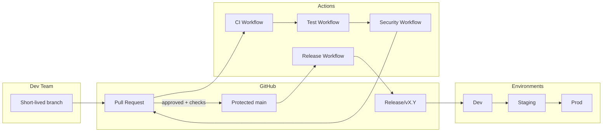
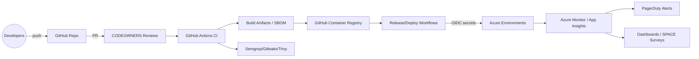

# DevOps Implementation Strategy

> **Assignment Brief Compliance**
>
> This DevOps implementation strategy is developed for the Real-Time Chat App project as part of the DevOps Pipelines module (CA1), in accordance with the 2026 assignment brief. The strategy is grounded in the CAMS model (Culture, Automation, Measurement, Sharing), DORA/SPACE/SRE metrics, and industry best practices for multi-person teams using GitHub Actions. All required areas from the brief are addressed and mapped in the table below.

| Assignment Requirement                | Section(s) Addressed         |
|---------------------------------------|------------------------------|
| DevOps principles (vision, values)    | 2. Vision, Values, Goals     |
| Branching strategy, integration ctrl  | 4. Branching Strategy        |
| CI/CD plan                           | 5. CI Plan, 6. CD Strategy   |
| Software release strategy             | 7. Software Release Strategy |
| Pipeline technology & tool selection  | 8. Toolchain Choices         |

> Module: DevOps Pipelines (CA1) — Project: Real-Time Chat App — Platform: GitHub / GitHub Actions

## 1. Context & Scope

- **Multi-person team**: This strategy is designed for a collaborative team (backend, frontend, infra, QA), not a solo developer project, as required by the brief.

- Team: multi-person (backend, frontend, infra, QA).
- Services: Node.js backend (Express + Socket.io), React frontend (Vite), MongoDB.
- Hosting target (recommended): container-based deployment to a managed platform (e.g., Azure Web App for Containers or Kubernetes). Pipelines are GitHub Actions-based.
- Source of truth: `main` branch; infrastructure, app code, and runbooks live in this repo.

## 2. Vision, Values, Goals (SMART, DORA-aligned)

- **Frameworks**: The strategy explicitly applies the CAMS model (see section 3) and DORA/SPACE/SRE metrics for measurement and improvement.

- **Vision**: Deliver chat features quickly with high reliability and strong feedback loops.
- **Values**: automation-first; quality-as-code; security-by-default; transparency; small, reversible changes.
- **Goals (12-month)**
  - Deployment frequency: ≥3 deploys/day to production from `main`.
  - Lead time for change: <1 hour from merge to prod for standard changes.
  - Change failure rate: ≤10% (tracked via incident tags on deploys).
  - MTTR: <30 minutes for Sev0/Sev1.
  - Availability SLO: 99.9% monthly; error budget ≤4 hours; P0 budget ≤2 hours/month.
  - CI health: ≥95% success; median pipeline ≤8 minutes; flaky test rate <1% of runs.

## 3. Frameworks & Metrics

- **CAMS model**: Culture, Automation, Measurement, and Sharing are mapped to team practices, automation, metrics, and knowledge sharing throughout this document.

- **CAMS mapping**
  - Culture: blameless postmortems; pair reviews; weekly pipeline demos; documented runbooks.
  - Automation: IaC, GitHub Actions workflows, policy-as-code (branch protections), repeatable test data.
  - Measurement: DORA, SLO/error-budget burn, CI duration, coverage (when added), flaky-test tracker, SPACE satisfaction pulse each sprint.
  - Sharing: ADRs, review checklists, incident write-ups, reusable workflow actions.
- **Metrics collection**
  - DORA: events from GitHub Actions + releases; failure rate via incident labels on deploys.
  - SRE: 99.9% SLO; burn alerts when ≥25% of budget consumed; MTTR from incident timeline.
  - CI: median/95th percentile duration; cache hit rate; queue time.

### Measurement & Baseline Plan

| Metric               | Baseline assumption (Q1 FY26)                    | Target                          | Instrumentation & cadence                                                             |
| -------------------- | ------------------------------------------------ | ------------------------------- | ------------------------------------------------------------------------------------- |
| Deployment frequency | 1 deploy/day triggered manually                  | ≥3 prod deploys/day             | GitHub Actions deployment events exported to Insights dashboard daily                 |
| Lead time for change | 4 hours (merge→prod) because of manual approvals | <1 hour median                  | Workflow telemetry via GitHub Actions API, charted weekly                             |
| Change failure rate  | 20% of deploys flagged during manual testing     | ≤10% with steady downward trend | Incident labels on release issues + PagerDuty postmortems reviewed per sprint         |
| MTTR                 | 90 minutes average                               | <30 minutes                     | Incident timeline in Statuspage + PagerDuty, reviewed in ops retro                    |
| Availability SLO     | 99.5% with ad-hoc monitoring                     | 99.9% with 4h budget            | Azure Monitor / App Insights SLO workbook evaluated weekly and on breach              |
| CI health            | 80% success, 15 min median duration              | ≥95% success, <8 min median     | GitHub Actions workflow metrics + Datadog monitor for queue/duration, inspected daily |

## 4. Branching Strategy & Integration Controls

- **Multi-person support**: The branching and review model is designed for traceability, collaboration, and safe integration in a team setting.

- **Model**: Trunk-based.
  - `main`: protected, always releasable.
  - `release/vX.Y`: cut for stabilization; hotfixes merge to tag + back to `main`.
  - Short-lived branches: `feat/*`, `fix/*`, `chore/*`, `docs/*`; lifespan ≤48h.
  - `hotfix/*`: from latest prod tag; fast path with post-merge retro.
- **Controls (GitHub)**
  - Branch protections on `main` and `release/*`: require status checks (CI), signed commits optional, linear history, no force-push.
  - Reviews: ≥1 reviewer; ≥2 for risky areas (auth, socket, db schema). Use CODEOWNERS to auto-assign.
  - Checks: frontend lint/build, backend install/build, security scan (template), SBOM + image scan (when containerized), secret scanning enabled.
  - PR hygiene: max ~300 LOC; include test evidence; link issue; draft PRs allowed for early feedback.
  - Commit style: Conventional Commits to enable automated changelog/versioning.
- **Review enablement**: CODEOWNERS lives in [.github/CODEOWNERS](.github/CODEOWNERS); reviewers apply the checklist in [docs/review-checklist.md](docs/review-checklist.md) and record CI evidence in the PR template.
- **Required checks**: `CI`, `Security Scans`, and `Release Build` (dry-run on tags) must succeed before merge; branch rules should block bypass without RCA.
- **Visual flow**:

## 5. CI Plan (GitHub Actions)

- **Platform**: All CI/CD is implemented using GitHub Actions, as required by the assignment brief.

- **Workflows**: `CI` (lint/test/build/coverage + Codecov) and `Security Scans` (Semgrep, Gitleaks, Trivy fs + image scan, SBOM via Syft). Legacy `cicd.yml`/`test.yml` are archived to avoid duplicate runs.

- **Triggers**: PRs to `main`; push to `main`; manual `workflow_dispatch`.
- **Runners**: `ubuntu-latest` hosted; self-hosted optional for heavy caching.
- **Secrets**: GitHub Environments per stage; prefer OIDC to cloud; never store secrets in repo.
- **Caching**: `actions/setup-node` npm cache for root and frontend lockfiles; Docker layer cache when container builds are added.
- **Job graph (ci.yml)**
  - Checkout → Node 20 → cache → `npm ci` (root) + `npm ci --prefix frontend` → `npm run lint --prefix frontend` → `npm run test -- --coverage` (backend + frontend via shared Vitest config) → `npm run build --prefix frontend` → Codecov upload of `coverage/lcov.info`.
  - Coverage thresholds enforced in Vitest config (≥80% lines/funcs/branches/statements).
  - Artifacts: LCOV uploaded for PR evidence.
- **Quality gates**: Required checks to protect `main`: `CI`, `Security Scans`, and `Release Build` (dry-run on tags). Secret scanning and Dependabot enabled via repo settings (manual enable by owner).
- **Changelog/versioning**: `release-please` workflow auto-creates release PRs, semantic versions, tags, and CHANGELOG entries on merges to `main`.
- **Performance target**: <8 minutes median; cancel in-progress on new commits per branch (concurrency control).

## 6. CD & Environment Strategy

- **Environments**: `dev` (auto deploy), `staging` (approval + smoke), `prod` (approval + change record). Secrets scoped per environment.
- **Immutable artifacts**: Build once on `main` (publish Docker images or tarballs) and promote by digest/tag.
- **Deployment patterns**: Prefer blue-green or canary for web apps; feature flags for risky changes; database migrations in expand/contract phases.
- **Approvals & audit**: GitHub Environment approvals; production requires two approvers not the author.
- **Post-deploy**: Smoke tests (HTTP 200, socket handshake); synthetic checks; auto-rollback to prior digest on failure signal; record deployment in releases.
- **Release workflow (template)**: Tag `vX.Y.Z` → generate changelog from Conventional Commits → build artifacts → attach to GitHub Release → (optionally) push images to registry.

- **Pipelines implemented**:
  - `release-please.yml`: runs in manifest mode for root and frontend packages, generates release PRs/tags and CHANGELOG entries using Conventional Commits semantics.
  - `release.yml`: builds/pushes GHCR images for backend/frontend, generates SBOM (Syft) per image, attaches artifacts to GitHub Release.
  - `deploy.yml`: parameterized `workflow_dispatch` deploy with environment approvals, image tag substitution to GHCR, rollout checks, rollback on failure, and smoke probe (TCP to backend:5000 and frontend:80).

## 7. Software Release Strategy

- **Traceability**: Semantic versioning and changelog automation are used for auditability and compliance.

- **Versioning**: Semantic Versioning; `vX.Y.Z` tags; pre-releases `vX.Y.Z-rc.N` on release branches.
- **Cadence**: Weekly scheduled release; hotfix anytime with post-incident review.
- **Change control**: Small batches (<1 day of work) to reduce blast radius; feature flags for long-running features.
- **Rollback**: Revert to previous image digest/tag; keep N-2 releases available. DB migrations reversible or split into expand/contract.
- **Documentation**: Release notes auto-generated; include deployment outcomes and incidents.

## 8. Pipeline Technology & Tool Selection

- **Justification**: Tool selection is based on integration with GitHub Actions, suitability for a multi-person team, and alignment with best practices.

| Category                          | Primary tooling                                                        | Key alternatives evaluated            | Rationale                                                                                                                                       |
| --------------------------------- | ---------------------------------------------------------------------- | ------------------------------------- | ----------------------------------------------------------------------------------------------------------------------------------------------- |
| SCM & Code Reviews                | GitHub + CODEOWNERS + branch protections                               | GitLab, Bitbucket Cloud               | Native integration with Actions, ubiquitous developer familiarity, CODEOWNERS automation, lower administrative overhead vs. GitLab self-hosting |
| CI/CD Orchestration               | GitHub Actions reusable workflows + environments                       | Azure DevOps Pipelines, CircleCI      | First-class repo integration, composite actions for reuse, environment protection rules, OIDC support without extra secrets                     |
| Build & Artifacts                 | Node 20 + npm workspaces, Vite, Docker BuildKit, GHCR                  | pnpm, Yarn 4, Cloud Native Buildpacks | Node 20 aligns with LTS support; BuildKit + GHCR keeps immutable digests and supports cached layers without extra SaaS cost                     |
| Testing Stack                     | Vitest + Testing Library + Playwright roadmap; Supertest for API       | Jest, Cypress, Mocha                  | Vitest faster with native Vite integration; Playwright supports cross-browser, while Supertest keeps API tests close to Express app             |
| Security & Compliance             | Dependabot, npm audit, Semgrep, Gitleaks, Trivy, Syft SBOM             | Snyk, GitGuardian, Anchore            | Combination covers SCA, SAST, secret scanning, container/image scanning using OSS tools; avoids extra licensing while meeting policy            |
| Observability & Incident Mgmt     | OpenTelemetry SDKs + Azure Monitor/App Insights dashboards + PagerDuty | Datadog, New Relic, Opsgenie          | Azure-native stack minimizes integration friction for container app hosting; retains vendor-neutral telemetry via OTLP                          |
| Infrastructure & Config mgmt      | Terraform/Bicep for IaC, Kustomize/Helm overlays, GitOps promotion     | Pulumi, Ansible, Flux CD              | Terraform/Bicep align with Azure; Kustomize/Helm support K8s overlays; GitOps keeps declarative state and audit trail                           |
| Collaboration & Knowledge Sharing | Markdown runbooks, ADRs, GitHub Discussions/Projects                   | Confluence, Notion, Jira              | Keeps single source of truth inside repo, version-controlled, and accessible without extra licensing; integrates with PR workflow               |

### Toolchain Architecture

## 9. Roles & Responsibilities (RACI outline)

- Devs: author code, add tests, create PRs, own feature flags, join incident retros.
- Tech Lead: approves risky changes, curates CODEOWNERS, owns architecture decisions.
- DevOps/Infra: maintains Actions workflows, secrets, environments, and IaC.
- QA/Peer Reviewer: enforces review checklist, verifies test evidence, monitors flaky tests.

## 10. Risks & Mitigations

- Flaky tests → track & quarantine; retry max 1; create tickets.
- Secrets leakage → enforce secret scanning; OIDC; no secrets in Actions logs.
- Long pipelines → cache tuning; parallelism; split jobs.
- Vendor lock-in → IaC kept in repo; avoid proprietary steps where possible.
- DB migrations risk → expand/contract with backward compatibility; run in staging first.

## 11. Implementation Roadmap (near-term)

1. Enable branch protections and CODEOWNERS.
2. Land CI workflow (`.github/workflows/ci.yml`).
3. Add release/build workflow (`.github/workflows/release.yml`) for tagged builds.
4. Define environments (dev/staging/prod) and store secrets.
5. Add security scans (Dependabot, Gitleaks, Semgrep) and SBOM/image scan when Dockerfiles are added.
6. Add automated changelog + semantic versioning; generate releases.
7. Add test suites (backend + frontend unit/e2e); wire into CI gates.
8. Document runbooks (deploy, rollback, incident response) and update this strategy quarterly.

## 12. Review Checklist (summary)

- Tests added/updated; evidence in PR.
- Security: secrets not logged; dependencies reviewed; auth/session impacts considered.
- Observability: logs/metrics/traces added for new flows.
- Rollback: migrations safe to roll back; feature flags available.
- Docs: README or runbooks updated if behavior changes.

---

## Acknowledgements

This document was prepared with the assistance of GitHub Copilot (GPT-4.1, Microsoft, https://github.com/features/copilot) and/or ChatGPT (OpenAI, https://chat.openai.com/). Prompts and outputs were reviewed and edited for accuracy and alignment with assignment requirements. See submission appendix for prompt history and method details.

This strategy is tailored to GitHub Actions and the current Node/React/Mongo stack and can be evolved as the system grows.
